# The 555-Timer: The Chip That Refused To Die

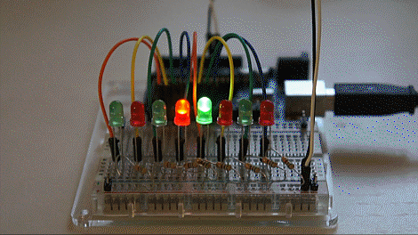

Have you ever looked at blinking LEDs, buzzing toys, or simple circuits and thought:

“Okay… but what’s actually going on here?” 🤔

Like seriously — how does a tiny chip make lights blink in perfect timing?

No code.  
No Arduino.  
Just… wires and components??

Feels like magic.

## Watt’s going on inside that sequence?

Have you ever looked at a piece of tech from the 70s and thought, "This belongs in a museum"?

This is your **entry into analog wizardry**, where we break down one of the most legendary chips ever made:

## 👉 The 555-Timer IC

### The G.O.A.T IC
- Generates accurate time delays
- Oscillations
- Pulse-width modulation(PWM)

“Wait… I can make circuits without coding??” 😳

### So, let's start exploring the everlasting world of the LEGEND 🫡

## The History

It was summer of 1970, a wizard at Signetics got to dump a new IC, which can oscillate based on the external culprit,the resistor and storage centre, the capacitor

But,the catch was

It should not be influenced by more supply power or surrounding  

Hans Camenzind, Started at 1971, Passed Several years on design and fabriation of the IC

The sales of 555 spiked such a huge that it's still alive in 2026

## The IMMORTAL 

It's still __ALIVE...__

- Versatility & Simplicity: 3 modes, sorry MOODS

- Robustness & Reliability: sink or source upto 200mA 

- Low Cost & Availability : Cheap & Go-to component

- Legacy Adoption: less complex than modern ICs

## Let's Continue...

#### The Original 555 Timer 

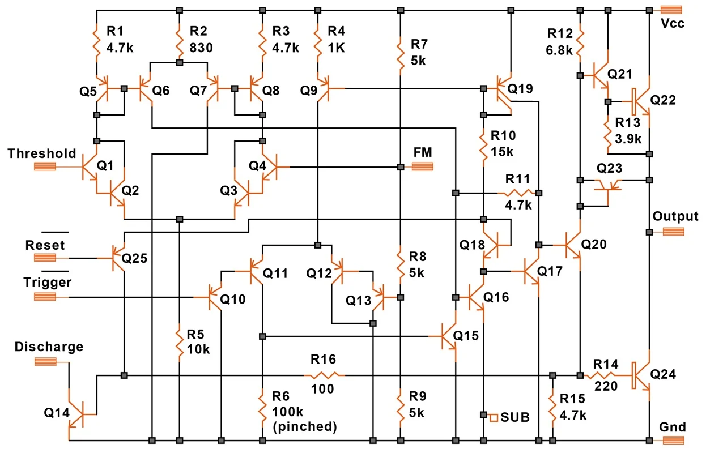

#### Flaws of the Original 555 Timer

The 555 was iconic… but yeah, it’s not perfect

- Poor Precision

- High Power Consumption

- Sudden Spikes on SWITCHING

## 555 as a Timer...

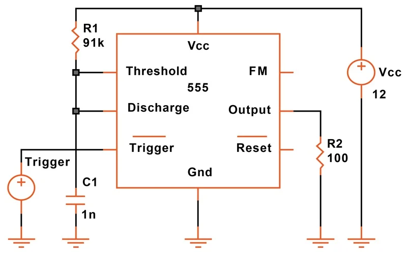

### So...  How it works ??

In the timer configuration, the period starts with a negative-going trigger pulse --> resets the flip-flop through Comparator 2 --> moves the output high.

When the voltage across C1 reaches 2/3 Vcc, Comparator 1 sets the flip-flop, C1 is rapidly discharged, and the output moves low.

#### Maths without ERRORS, Not poss...

The error in timing is around 1% with a temperature coefficient of 24 ppm/°C. The timing formula is:

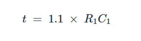

### The Resulting Waveform

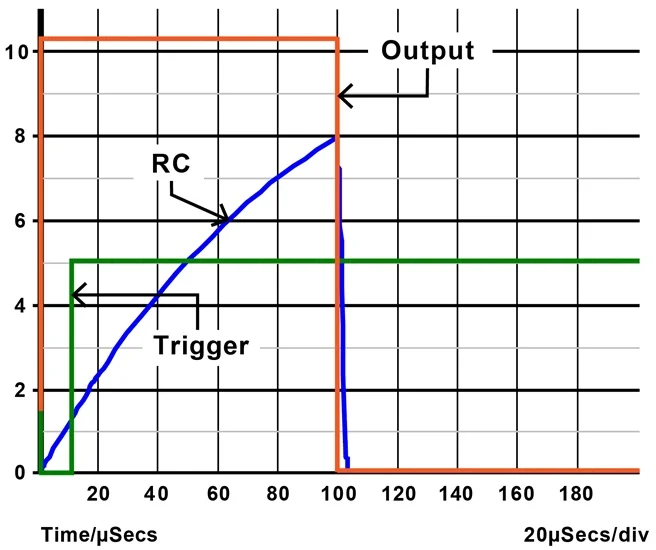

## 555 as an Oscillator...

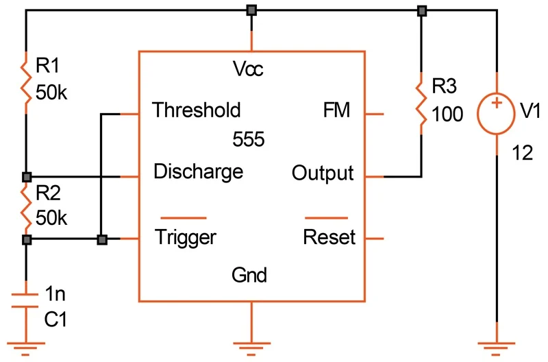

### How it works ??

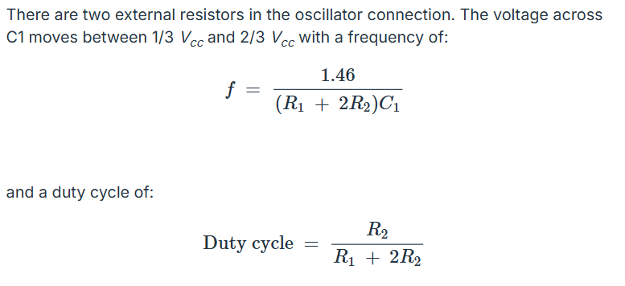

### Oscillator waveforms

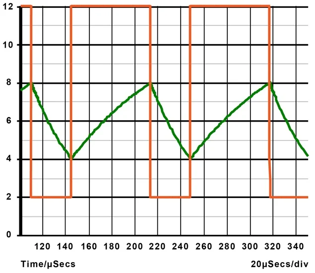

### Huhh! everything messed Up...

## 3 - Moods of operation

visit --> https://youtu.be/qfWIjb48mjE?si=TlXi7bBBEWLAjAjm

### Astable Mode --> The Pulse
It Oscillates forever. Perfect for blinking lights or annoying buzzers.

Used as an Oscillator, pulse generator, logic clocks,etc.

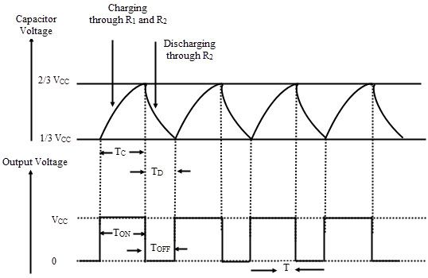

### Monostable Mode --> The One-Shot 
Press a button --> Output goes high for a set time --> Output dies

Used in frequency divider, timers, pulse detection and touch switches. 

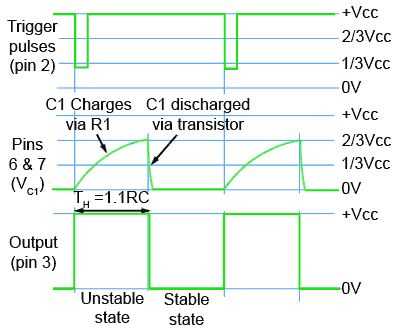

### Bistable Mode --> The Toggle 
Like a light switch. Hit one pin to turn it on, another to turn it off.

Used as a flip-flop, latches.

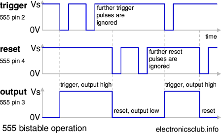

# Let's get your hand DIRTY !

## Motion Detector Alarm using 555 Timer

## 1.  Objective

### Design a circuit that:

- Detects motion using a PIR sensor

- Activates an alarm (buzzer)

- Uses a 555 timer in monostable mode to control alarm duration

## 2. Working Principle

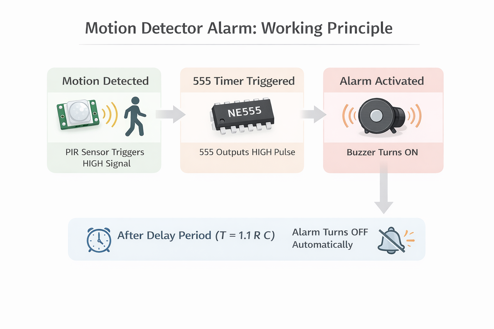

## 3. Components Required

### Component - Quantity
- NE555 Timer IC - 1
- PIR Sensor (HC-SR501) - 1
- NPN Transistor (BC547) - 1
- Buzzer - 1
- Resistor 10kΩ	- 1
- Resistor 1kΩ -1
- Capacitor 10µF - 1
- Power Supply (5–9V) - 1
- Breadboard + Wires (as per requirement)

## FlowCharts and Circuit Diagrams for reference 

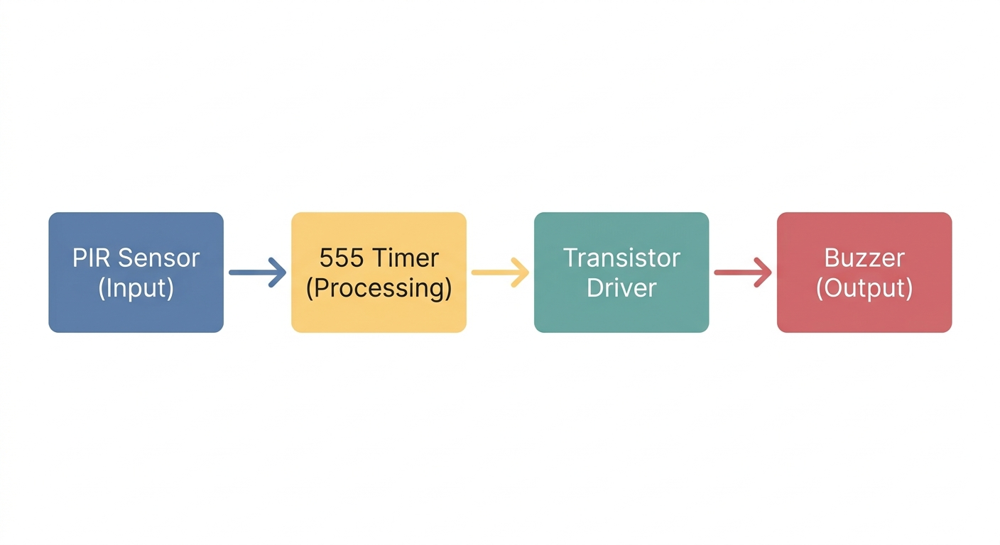

## Circuit Diagram

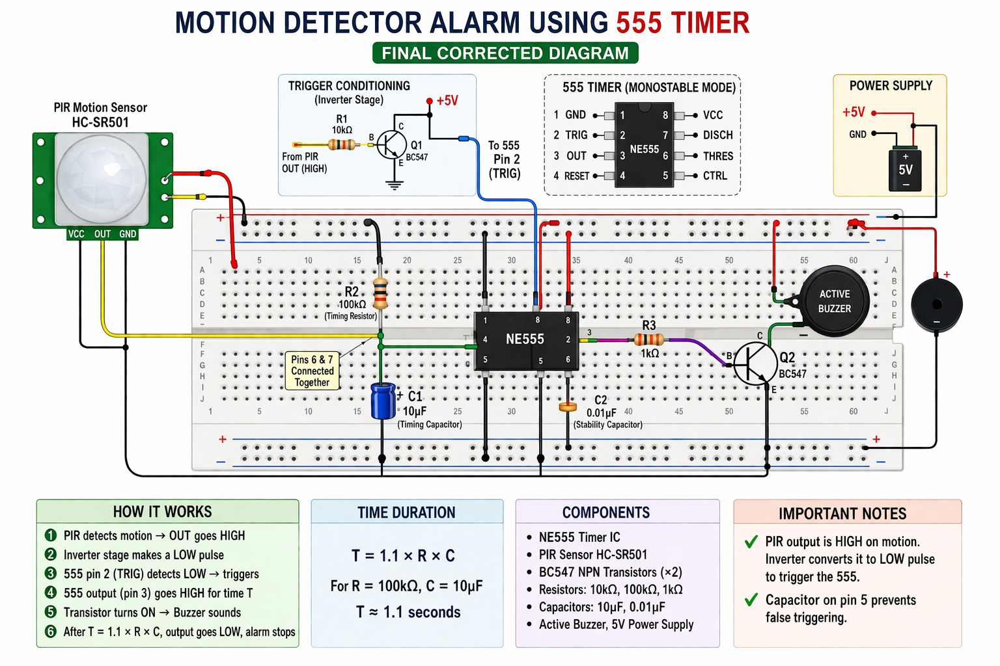

## Yay! You’ve mastered the 555 Timer!

You’ve gone from __"What is this 8-pin bug?"__ to building security systems . You’ve dealt with voltage regulators, timing loops, and the dreaded "ghost pins."

Now that you know how to control Timing, you’re ready for the big leagues. It’s time to move from chips that do one thing to chips that can be programmed to do anything.

## Let your curiosity flow. Stay grounded, stay charged ⚡

