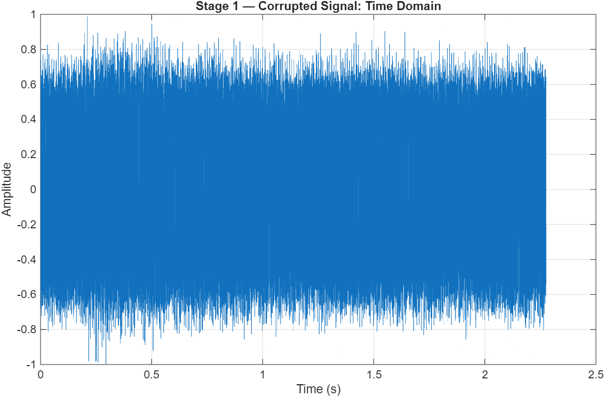
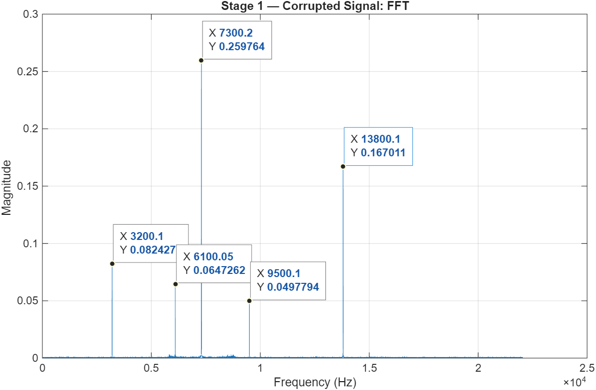
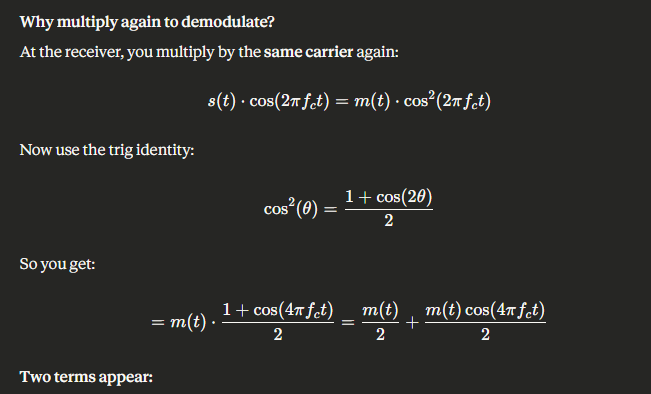
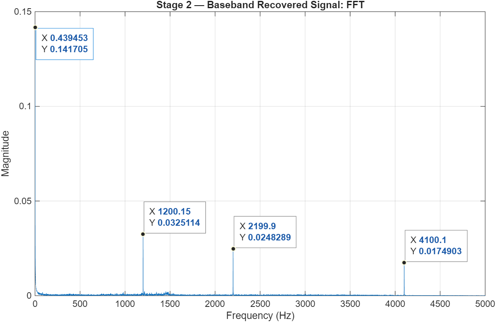
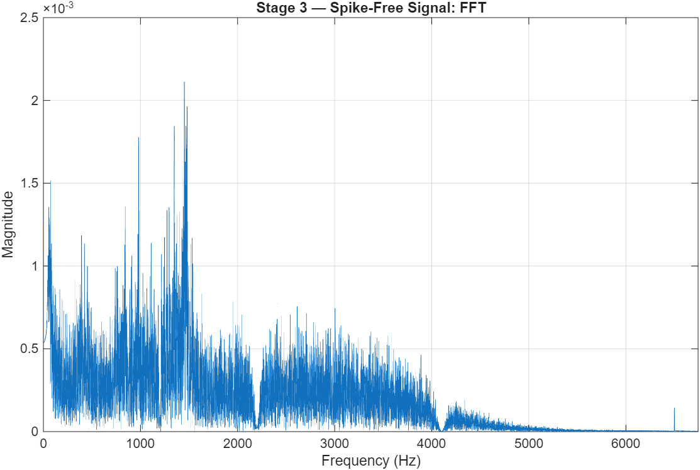
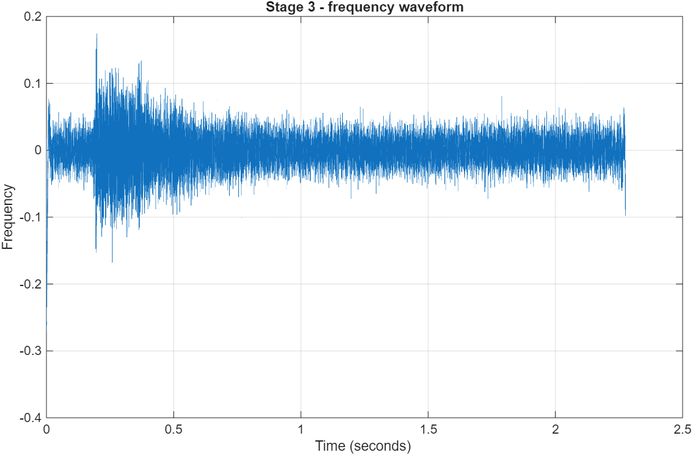

### Resources -->
 https://www.mathworks.com/help/matlab/ref/fft.html, https://in.mathworks.com/matlabcentral/answers/565580-amplitude-modulation-demodulation-signal, https://in.mathworks.com/help/signal/ref/butter.html, https://in.mathworks.com/help/dsp/ref/iirnotch.html, 

#### SOLVED USING MATLAB 

## <------------------------------------ THE PROCESSING PIPELINE ------------------------------->
### Load & FFT Analysis --> AM demodulation + Low Pass Filteration --> Notch Filtering --> DC/low-frequency removal

# STAGE 1
## Input/Load the data
Using audioread() to get the audio file.
Here,
N=length of input signal (100352)
then creating time domain axis --> (0:N-1)/Fs 

## Time Domain Frequency Plot
#### So,plotting Time Domain Waveform --> gives cluttered and noisy plot

 

## Fast Fourier Transform(FFT)
Then using the fast fourier transform(FFT) to compute the frequency content.The single sided magnitude spectrum is shown only for simplicity(as for real signals, conjugates also gives the same plot, so taking only the single side of that but the overall magnitude gets doubled due to energy distribution to all points)

### Calculations-->
By using fft(x,N) --> defining the frequency domain 'f'--> got two sided spectrum --> reducing to single sided spectrum

 

# STAGE 2
## Amplitute Demodulation
Since, the freqency magnitude exceeds the human speech range(0-4000Hz), so the signal must have modulated/amplified using some carrier wave.

Thus, the carrier frequency, where most of the energy is centered is calculated by finding the peaks in fft curve and then get the max of them.

Now, to demodulate the Signal_corrupted.wav, we will multiply it again with our signal, because :

 

 ### m(t)/2 --> original message (scaled by ½)
 ### m(t)·cos(4πf_c t) --> 2Message shifted up to 2f_c

 So, to remove the the m(t)·cos(4πf_c t) term, we use a LOW PASS FILTER (ButterWorth, 6th order) with 4000Hz cutoff --> filtfilt is used for zero-Phase filtering to preserve the waveform shape.

Therefore, after Demodulation and Low pass filteration, the baseband recovered signal looks like this:

 

# STAGE 3
## Spikes Removal using IIR Notch filters

Since, there are some noisy spikes in the baseband recovered signal, so to isolate them firstly we find the spikes in the range of 4000(+/-500)Hz using a threshold of mean +6 standard deviation.

Then applying the IIR notch filter with quality factor Q ≈ 35 to each detected spike frequency and again filtfilt ensures zero-phase distortion.

Also during demodulation process some DC offset is intoduced into the signal, so using a 4th-order High Pass Filter at 50Hz to remove the residual DC component or very-low-frequency rumble.

## So, the spike free signal looks like this: 

## And the stage 3 recovered audio signal in Time Domain:

